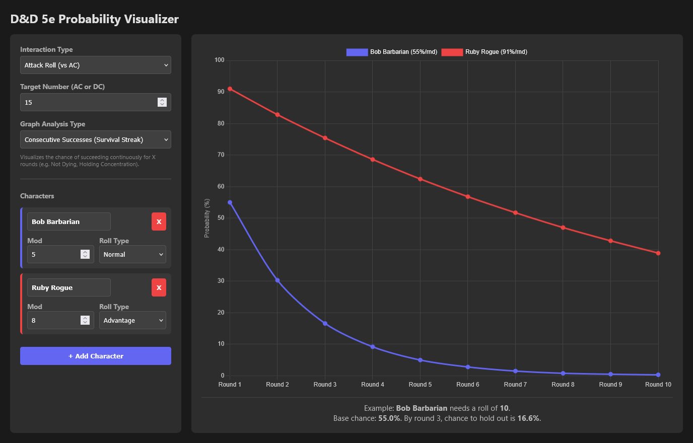

# D&D 5e Probability Visualizer

## Purpose

This tool helps to visualize the chance of success or failure for various D20 tests in D&D 5e (to hit, ability check, saving throw).

Input the target AC or DC to beat and the tool will visualize the chance of consecutive successes or at least one success.

If the mode is set to "Attack Roll" then the tool takes into account the special rule that a 1 is a critical miss that always misses and a 20 is a critical hit that always hits.
Ability checks and saving throws do not have this behavior (rules as written).

The tool also takes into account whether the roll is made as a straight roll or with advantage or disadvantage.

### Use cases

1. Consecutive successes: In a scenario where a single failure is critical, then this mode shows the chance that the character will be able to continually pass over repeated tests.
2. Cumulative probability: In a scenario where a test is difficult to succeed and may require several attempts, this mode shows the cumulative probability that the test will pass at least once over repeated attempts.

### Examples

1. A monster can attempt to petrify the party once per round. The DC to save is 15. Three player characters have saving throw modifiers of +1, +3 and +5. The visualizer shows that the character with +1 has only a 4.3% chance to resist 3 consecutive petrification attempts. After 6 rounds, it is exceedingly likely that all characters would be petrified.
2. An archer attempts to hit a bulls-eye at the furthest edge of their longbow range. The AC is 30 and the to hit modifier is +5. Since there is always a chance of a natural 20, after 10 attempts, there is a 40.1% chance that the archer hits their mark at least once.

## License

None. This was vibe coded.
